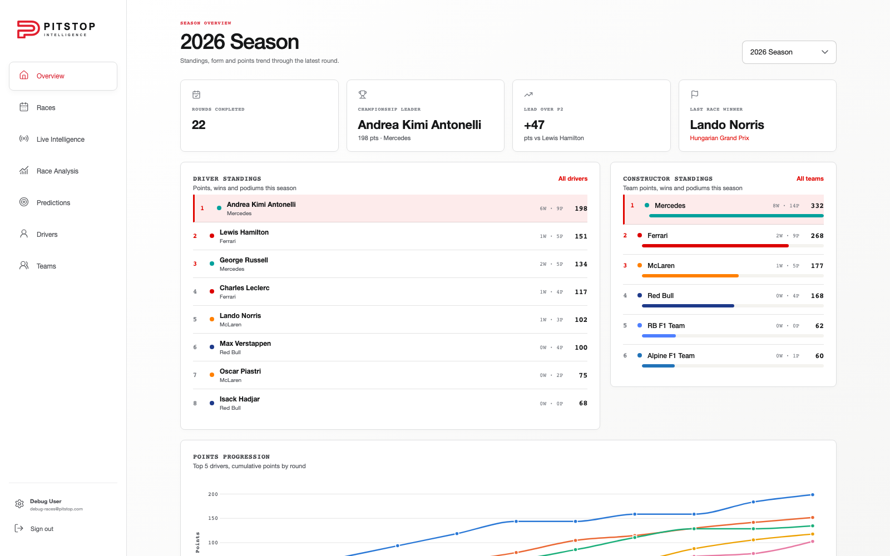
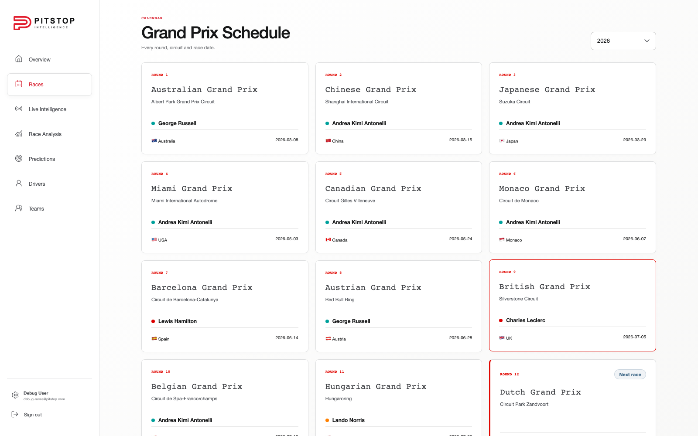
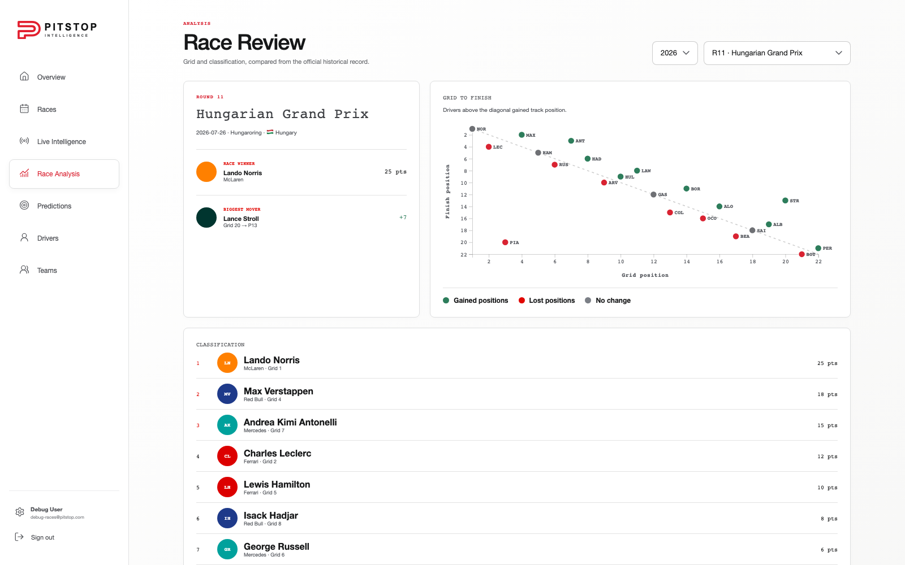
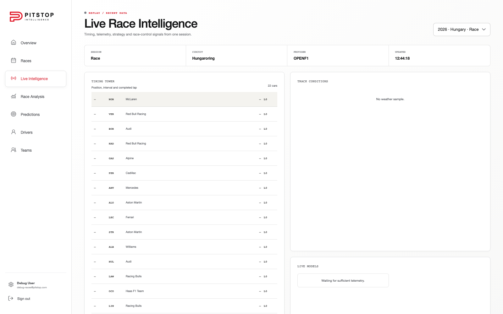
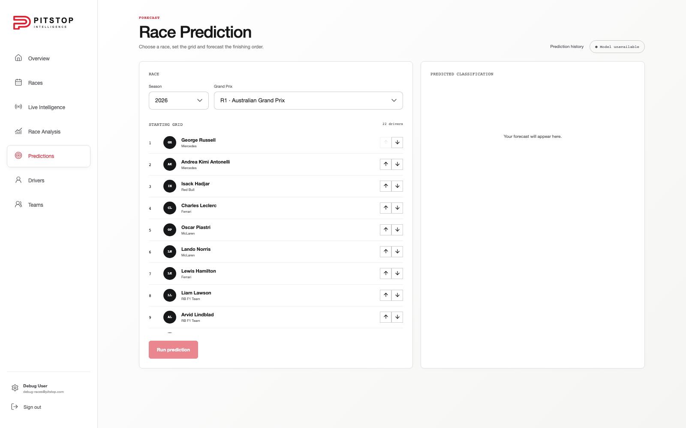
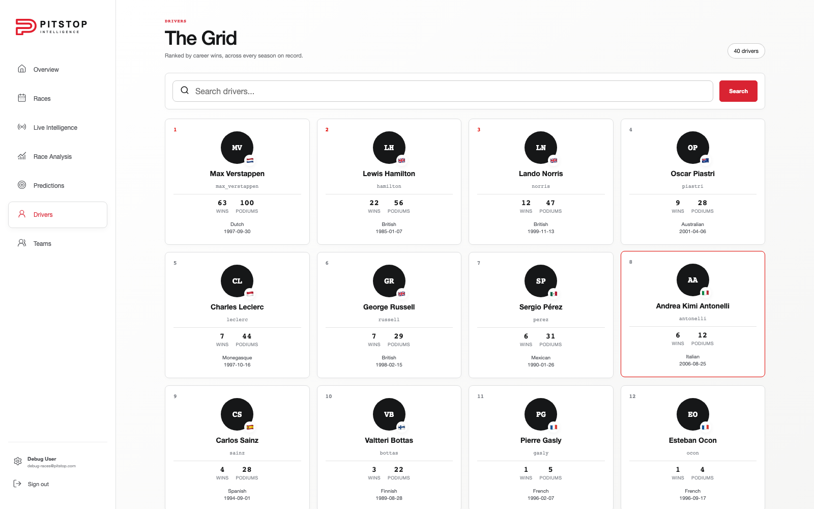
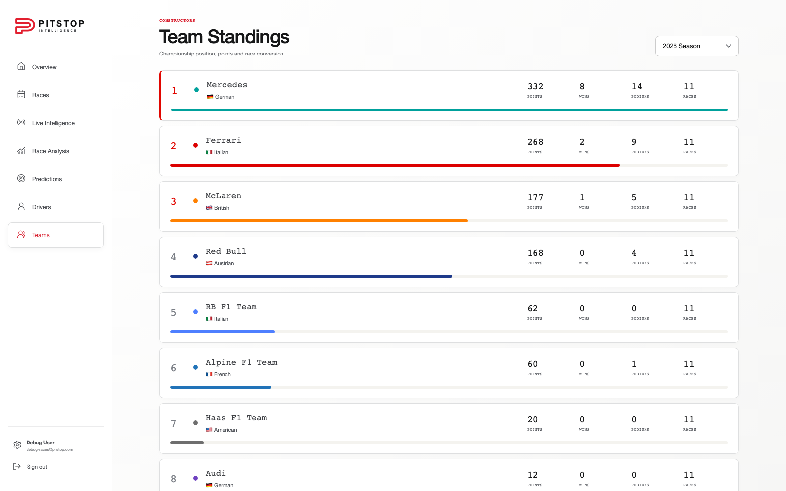
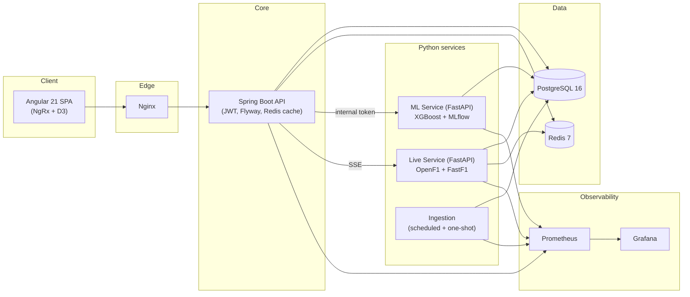

<div align="center">



# 🏁 Pitstop Intelligence

**A full-stack Formula 1 analytics platform** — live timing, historical race analysis,
championship standings and ML-driven race predictions, backed by a real microservice
architecture.

[](https://github.com/anshkataria/pitstop-intelligence/actions/workflows/ci.yml)
[](https://github.com/anshkataria/pitstop-intelligence/actions/workflows/security.yml)
[](LICENSE)


</div>

---

## What is this?

Pitstop Intelligence ingests real F1 historical data (Ergast/Jolpica) and live session
data (OpenF1 + FastF1), stores it in PostgreSQL, and serves it through a Spring Boot API
to an Angular dashboard — with a dedicated Python ML service forecasting race results
and a live-timing service streaming session data over SSE.

It's built the way a production system would be: JWT auth, Redis caching, Flyway
migrations, Prometheus/Grafana observability, health-checked Docker Compose stacks for
dev/prod/VPS, and CI with CodeQL security scanning.

## ✨ Features

| Page | What it does |
|---|---|
| **Overview** | Season standings, championship gaps, and a points-progression chart for the top 5 drivers |
| **Races** | Full Grand Prix calendar for any season, with round, circuit, country and winner |
| **Race Analysis** | Grid-to-finish scatter plot, biggest movers, and full classification for any race |
| **Live Intelligence** | Live/replay timing tower, track conditions and telemetry streamed from OpenF1 & FastF1 |
| **Predictions** | Set a starting grid and get an ML-forecasted finishing order (XGBoost, tracked with MLflow) |
| **Drivers** | Searchable driver roster ranked by career wins and podiums |
| **Teams** | Constructor standings with points, wins and podiums per season |

## 📸 Screenshots

<table>
<tr>
<td width="50%"><p align="center"><em>Grand Prix Schedule</em></p></td>
<td width="50%"><p align="center"><em>Race Review & Analysis</em></p></td>
</tr>
<tr>
<td width="50%"><p align="center"><em>Live Race Intelligence</em></p></td>
<td width="50%"><p align="center"><em>Race Prediction</em></p></td>
</tr>
<tr>
<td width="50%"><p align="center"><em>The Grid — Drivers</em></p></td>
<td width="50%"><p align="center"><em>Team Standings</em></p></td>
</tr>
</table>

## 🏗️ Architecture



Only Nginx (and the Spring Boot API in local dev) is exposed publicly. The ML and live
services are private — Spring authenticates every user request and forwards internal
calls with a private service token, so the browser never talks to Python directly.

## 🧰 Tech stack

| Layer | Stack |
|---|---|
| **Frontend** | Angular 21 (standalone components), NgRx (store/effects/entity), D3.js, Lucide icons |
| **Backend API** | Java 21, Spring Boot 3.5, Spring Security (JWT), Spring Data JPA, Flyway, Redis cache |
| **ML service** | Python, FastAPI, XGBoost, scikit-learn, pandas, MLflow |
| **Live service** | Python, FastAPI, OpenF1 API, FastF1 (historical telemetry replay), Redis pub/sub, SSE |
| **Ingestion** | Python, Ergast/Jolpica API, APScheduler-style cron worker |
| **Data** | PostgreSQL 16, Redis 7 |
| **Observability** | Prometheus, Grafana |
| **Infra** | Docker Compose (dev / prod / VPS), Caddy (TLS reverse proxy), GitHub Actions CI + CodeQL |

## 🚀 Getting started

**Prerequisites:** Docker, Docker Compose

```bash
git clone https://github.com/anshkataria/pitstop-intelligence.git
cd pitstop-intelligence

cp .env.example .env
# replace the JWT_SECRET and ML_INTERNAL_TOKEN placeholders with random values

docker compose up --build
```

Open **http://localhost:4200**, register an account, and you're in.

Load historical race data (drivers, races, results) once the stack is healthy:

```bash
./scripts/run-ingestion.sh
```

`SEASONS_TO_FETCH` in `.env` controls which seasons get imported. An always-on
`ingestion-scheduler` container also re-runs the pipeline automatically on a cron
schedule — see [`docs/docker-and-deployment.md`](docs/docker-and-deployment.md).

### Optional: monitoring stack

```bash
docker compose --profile monitoring up -d
```

Grafana is available at `http://localhost:3000` (private by default — bound to
`127.0.0.1`).

## 📁 Project structure

```text
pitstop-intelligence/
├── frontend/      Angular 21 SPA
├── backend/       Spring Boot API (auth, races, drivers, predictions, live SSE gateway)
├── ml-service/    FastAPI service — race prediction model (XGBoost, MLflow)
├── live-service/  FastAPI service — live timing & telemetry (OpenF1, FastF1)
├── ingestion/     Historical data ingestion (Ergast/Jolpica)
├── monitoring/    Prometheus + Grafana provisioning
├── deploy/        Caddy config + systemd units for VPS deployment
├── docker/        Postgres init scripts
├── scripts/       Ingestion, backup/restore and e2e helper scripts
└── docs/          Deployment and architecture docs
```

## 🧪 Testing & CI

Every push runs backend (Spring/JUnit), frontend (Angular unit tests + Playwright e2e)
and Python (pytest, per service) test suites, then validates and builds every Docker
image. A separate workflow runs CodeQL analysis and dependency review on every PR.

```bash
# Backend
cd backend && ./mvnw test

# Frontend
cd frontend && npm test
cd frontend && npm run e2e

# Python services
cd ml-service && PYTHONPATH=src pytest
cd live-service && PYTHONPATH=src pytest
cd ingestion && PYTHONPATH=src pytest
```

## 🔐 Security notes

- JWT-based auth with short-lived access tokens + refresh tokens.
- Public registration only ever creates `USER` accounts; `POST /api/v1/ml/train` and
  live replay creation require `ADMIN`, promoted via an audited DB update — see
  [`docs/docker-and-deployment.md`](docs/docker-and-deployment.md).
- The ML and live services are never exposed publicly and only accept requests
  carrying a private internal token set by Spring.

## 📦 Deployment

Production Compose overlays (`docker-compose.prod.yml`, `docker-compose.vps.yml`) add
resource limits, restart policies, a Caddy TLS gateway and pinned image tags published
by the `release-images.yml` workflow to GHCR. See
[`docs/docker-and-deployment.md`](docs/docker-and-deployment.md) for the full deployment
guide, including database backup/restore scripts and systemd timers.

## License

MIT — see [LICENSE](LICENSE).
